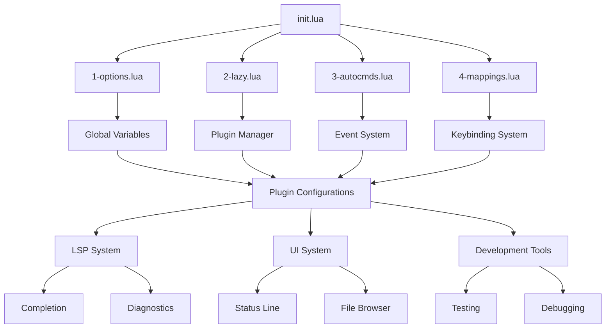
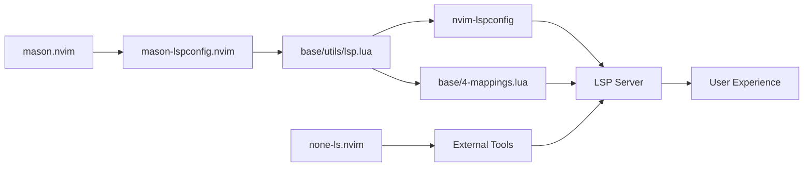

# Component Cross-Reference Documentation

<!--toc:start-->
- [Component Cross-Reference Documentation](#component-cross-reference-documentation)
  - [Integration Map](#integration-map)
  - [Loading Dependencies](#loading-dependencies)
    - [Critical Loading Order](#critical-loading-order)
    - [Plugin Loading Events](#plugin-loading-events)
    - [Dependency Chain](#dependency-chain)
  - [Configuration Flow](#configuration-flow)
    - [Options Propagation](#options-propagation)
    - [Feature Toggle System](#feature-toggle-system)
    - [Hot Reload Integration](#hot-reload-integration)
  - [LSP Integration Network](#lsp-integration-network)
    - [LSP Configuration Flow](#lsp-configuration-flow)
    - [Server Setup Chain](#server-setup-chain)
    - [Capability Management](#capability-management)
  - [UI Component Relationships](#ui-component-relationships)
    - [Status Line Integration](#status-line-integration)
    - [Icon System](#icon-system)
    - [Theme Integration](#theme-integration)
  - [Event System](#event-system)
    - [Custom Events](#custom-events)
    - [Plugin Communication](#plugin-communication)
    - [Lazy Loading Triggers](#lazy-loading-triggers)
  - [Utility Function Network](#utility-function-network)
    - [Core Utilities Usage](#core-utilities-usage)
    - [Cross-Component Dependencies](#cross-component-dependencies)
    - [Performance Optimizations](#performance-optimizations)
  - [Testing & Quality Integration](#testing--quality-integration)
    - [Health Check System](#health-check-system)
    - [Debugging Integration](#debugging-integration)
    - [Error Handling Chain](#error-handling-chain)
  - [Customization Points](#customization-points)
    - [Safe Extension Points](#safe-extension-points)
    - [Override Mechanisms](#override-mechanisms)
    - [Plugin Addition Guidelines](#plugin-addition-guidelines)
<!--toc:end-->

## Integration Map

NormalNvim components form a tightly integrated ecosystem where each component serves specific roles while maintaining clean interfaces. This document maps the relationships and dependencies between all components.



---

## Loading Dependencies

### Critical Loading Order

**Phase 1: Foundation** (Synchronous, Order-Critical)
```lua
-- init.lua orchestrates this exact sequence
load_sources({
  "base.1-options",    -- MUST be first: Sets global variables
  "base.2-lazy",       -- MUST be second: Initializes plugin manager
  "base.3-autocmds",   -- MUST be third: Sets up event handlers
})
```

**Phase 2: Theming** (Synchronous)
```lua
load_colorscheme(vim.g.default_colorscheme)  -- Apply theme immediately
```

**Phase 3: Non-Critical** (Asynchronous, 50ms delay)
```lua
load_sources_async({ "base.4-mappings" })    -- Keybindings can load later
```

**Why This Order Matters**:
- **Options first**: Plugins check `vim.g.*` variables during setup
- **Lazy second**: Must be initialized before any plugin loading
- **Autocmds third**: Event handlers must exist before plugins trigger events
- **Mappings last**: Can load asynchronously without breaking functionality

### Plugin Loading Events

**Event Hierarchy**:
```lua
-- Custom events (triggered by base modules)
"User BaseFile"       -- After file-related autocmds setup
"User BaseDefered"    -- After main initialization, before UI
"User LoadColorSchemes" -- When colorscheme loading should occur

-- Neovim events
"VeryLazy"           -- After startup, used by many plugins
"InsertEnter"        -- When entering insert mode (completion)
"LspAttach"          -- When LSP server attaches
"BufEnter"           -- When entering a buffer
```

**Event Flow**:
1. **Neovim starts** → `base.1-options` loaded
2. **Plugin manager ready** → `base.2-lazy` loaded  
3. **Autocmds created** → `base.3-autocmds` loaded
4. **Custom events triggered**:
   - `User BaseFile` → File-related plugins load
   - `User LoadColorSchemes` → Themes load
   - `User BaseDefered` → UI and workflow plugins load
5. **Async phase** → `base.4-mappings` loaded

### Dependency Chain

**Core Dependencies**:
```
init.lua
├── base/1-options.lua (no dependencies)
├── base/2-lazy.lua (depends on: options global variables)
├── base/3-autocmds.lua (depends on: lazy.nvim setup)
└── base/4-mappings.lua (depends on: all above + utils)
```

**Utility Dependencies**:
```
base/utils/init.lua
├── Used by: ALL components
├── Depends on: Neovim API only
└── Provides: Core utilities, plugin checks, icon management

base/utils/lsp.lua  
├── Used by: LSP plugins, mason-lspconfig
├── Depends on: base/utils/init.lua, base/4-mappings.lua
└── Provides: LSP configuration, server setup

base/utils/ui.lua
├── Used by: UI plugins, status line
├── Depends on: base/utils/init.lua
└── Provides: UI toggle functions
```

---

## Configuration Flow

### Options Propagation

**Global Variable Flow**:
```lua
-- 1. Set in base/1-options.lua
vim.g.default_colorscheme = "astrodark"
vim.g.cmp_enabled = true
vim.g.diagnostics_mode = 3

-- 2. Read by plugins during setup
-- In plugin configurations:
if vim.g.cmp_enabled then
  -- Enable completion plugin
end

-- 3. Modified by UI toggles
-- In base/utils/ui.lua:
function M.toggle_cmp()
  vim.g.cmp_enabled = not vim.g.cmp_enabled
  -- Reload completion system
end
```

**Configuration Inheritance**:
```
base/1-options.lua
├── Sets: vim.g.* (global variables)
├── Sets: vim.opt.* (editor options)
└── Read by: ALL plugins for conditional features

plugins/*.lua
├── Check: utils.is_available() for optional plugins
├── Check: vim.g.* for feature toggles
└── Apply: Conditional configuration based on checks
```

### Feature Toggle System

**Toggle Architecture**:
```lua
-- Toggle definition (1-options.lua)
vim.g.autopairs_enabled = true

-- Plugin conditional loading (plugins/1-base-behaviors.lua)  
{
  "windwp/nvim-autopairs",
  cond = function() return vim.g.autopairs_enabled end,
  -- Plugin only loads if toggle is true
}

-- Runtime toggle (base/utils/ui.lua)
function M.toggle_autopairs()
  vim.g.autopairs_enabled = not vim.g.autopairs_enabled
  -- Additional logic to enable/disable at runtime
end

-- Keybinding (base/4-mappings.lua)
maps.n["<leader>ua"] = { 
  function() require("base.utils.ui").toggle_autopairs() end,
  desc = "Toggle autopairs" 
}
```

**Toggle Integration Points**:
- **Options**: Define default states
- **Plugins**: Conditional loading based on toggles
- **UI Utils**: Runtime toggle functions
- **Mappings**: User interface for toggles
- **Status Line**: Visual indicators of toggle states

### Hot Reload Integration

**Hot Reload Capable Files**:
```lua
-- base/1-options.lua
-- Changes apply immediately via hot-reload.nvim
vim.g.default_colorscheme = "tokyonight"  -- Theme changes instantly

-- base/4-mappings.lua  
-- Keybinding changes apply immediately
maps.n["<leader>x"] = { ":new_command<cr>", desc = "New mapping" }
```

**Hot Reload Chain**:
1. **File change detected** → hot-reload.nvim triggers
2. **Module reloaded** → `require()` cache cleared
3. **Configuration reapplied** → New settings take effect
4. **UI updates** → Visual changes appear immediately

**Non-Hot-Reloadable**:
- Plugin specifications (require Neovim restart)
- LSP server configurations (require `:LspRestart`)
- Autocmd definitions (require restart)

---

## LSP Integration Network

### LSP Configuration Flow



**Configuration Chain**:
1. **Mason** installs LSP servers, formatters, linters
2. **Mason-lspconfig** provides automatic server setup handlers
3. **utils_lsp.setup()** called for each server with custom configuration
4. **utils_lsp.apply_user_lsp_settings()** applies server-specific settings
5. **utils_lsp.apply_user_lsp_mappings()** adds keybindings when server attaches
6. **none-ls** integrates external tools as LSP sources

### Server Setup Chain

**Per-Server Setup Process**:
```lua
-- 1. Mason installs server
-- 2. Mason-lspconfig detects installation
-- 3. Setup handler called:
require("mason-lspconfig").setup_handlers({
  function(server_name)
    utils_lsp.setup(server_name)  -- 4. Custom setup function
  end
})

-- 5. In utils_lsp.setup():
function M.setup(server_name)
  local opts = M.apply_user_lsp_settings(server_name)  -- Get config
  local handler = require("lspconfig")[server_name].setup(opts)  -- Setup server
  if handler then handler(server_name, opts) end
end

-- 6. When server attaches:
opts.on_attach = function(client, bufnr)
  -- Apply keybindings specific to this buffer
  M.apply_user_lsp_mappings(client, bufnr)
end
```

### Capability Management

**Capability Flow**:
```lua
-- 1. Base capabilities (utils/lsp.lua)
M.capabilities = vim.lsp.protocol.make_client_capabilities()

-- 2. Enhanced by completion plugin
M.capabilities.textDocument.completion = cmp_nvim_lsp.default_capabilities()

-- 3. Enhanced by other plugins
M.capabilities.textDocument.foldingRange = { -- nvim-ufo
  dynamicRegistration = false,
  lineFoldingOnly = true
}

-- 4. Applied to each server
opts.capabilities = M.capabilities

-- 5. Server responds with actual capabilities
-- 6. Features enabled/disabled based on server support
```

**Capability Integration Points**:
- **nvim-cmp**: Completion capabilities
- **nvim-ufo**: Folding capabilities  
- **telescope**: Document symbols, workspace symbols
- **DAP**: Debugging capabilities (when available)

---

## UI Component Relationships

### Status Line Integration

**Heirline Component Architecture**:
```lua
-- Status line components (from heirline-components.nvim)
statusline = {
  -- File info section
  { provider = file_info, condition = conditions.buffer_not_empty },
  
  -- Git section  
  { provider = git_branch, condition = conditions.is_git_repo },
  { provider = git_diff, condition = conditions.has_changes },
  
  -- LSP section
  { provider = lsp_active, condition = conditions.lsp_attached },
  { provider = diagnostics, condition = conditions.has_diagnostics },
  
  -- Right side
  { provider = "%=", hl = { bg = "bg" } },  -- Spacer
  { provider = file_encoding },
  { provider = position_info },
}
```

**Data Sources**:
- **File info**: Buffer name, modification status, file type
- **Git**: gitsigns.nvim provides branch, diff stats
- **LSP**: Active servers, diagnostic counts from vim.diagnostic
- **Position**: Line/column, percentage through file

**Integration Points**:
```lua
-- Plugin provides data → Status line displays it
gitsigns → git_branch, git_diff components
LSP servers → lsp_active, diagnostics components  
File system → file_info, file_encoding components
nvim-web-devicons → file type icons
```

### Icon System

**Icon Resolution Chain**:
```lua
-- 1. Request icon
local icon = utils.get_icon("DiagnosticError")

-- 2. Check fallback mode
if vim.g.fallback_icons_enabled then
  return require("base.icons.fallback_icons")["DiagnosticError"]  -- "E"
else
  return require("base.icons.icons")["DiagnosticError"]  -- ""
end

-- 3. Cache result in utils module
-- 4. Return icon to requester
```

**Icon Usage Map**:
```
base/icons/icons.lua
├── Used by: Status line (file types, git status)
├── Used by: Completion (lspkind icons)
├── Used by: Diagnostics (error/warning symbols)  
├── Used by: File browsers (file type indicators)
├── Used by: Which-key (command group icons)
└── Used by: DAP (debugger symbols)
```

### Theme Integration

**Theme Loading Process**:
```lua
-- 1. Theme plugins register with event
event = "User LoadColorSchemes"

-- 2. Theme selection (1-options.lua)
vim.g.default_colorscheme = "astrodark"

-- 3. Theme application (init.lua)
load_colorscheme(vim.g.default_colorscheme)

-- 4. Plugin integrations activate
-- Each UI plugin adapts to active colorscheme
```

**Theme Integration Points**:
- **Heirline**: Status line colors adapt to theme
- **nvim-cmp**: Completion menu colors match theme
- **Telescope**: Picker colors integrate with theme
- **nvim-notify**: Notification colors coordinate with theme
- **Diagnostics**: Error/warning colors complement theme

---

## Event System

### Custom Events

**Event Definition and Usage**:
```lua
-- Event trigger (base/utils/init.lua)
function M.trigger_event(event, is_urgent)
  if is_urgent then
    vim.api.nvim_exec_autocmds("User", { pattern = event })
  else
    vim.schedule(function()
      vim.api.nvim_exec_autocmds("User", { pattern = event })
    end)
  end
end

-- Event usage in plugins
event = "User BaseDefered"  -- Load after main initialization

-- Event listener (in autocmds)
vim.api.nvim_create_autocmd("User", {
  pattern = "BaseDefered",
  callback = function()
    -- Trigger deferred initialization
  end
})
```

**Custom Event Flow**:
1. **BaseFile** → Triggered after file-related autocmds setup
2. **BaseDefered** → Triggered for UI and workflow plugins
3. **LoadColorSchemes** → Triggered for theme loading

### Plugin Communication

**Inter-Plugin Communication Patterns**:
```lua
-- 1. Shared utilities (most common)
local utils = require("base.utils")
if utils.is_available("telescope.nvim") then
  -- Integrate with telescope
end

-- 2. Global state sharing
vim.g.current_project_root = "/path/to/project"
-- Other plugins can read this global state

-- 3. Event-based communication
vim.api.nvim_exec_autocmds("User", { 
  pattern = "ProjectChanged", 
  data = { root = new_root }
})

-- 4. Plugin API exposure
_G.MyPluginAPI = {
  get_status = function() return status end,
  set_config = function(config) -- update config end,
}
```

### Lazy Loading Triggers

**Event-Based Loading**:
```lua
-- File-related plugins
event = "User BaseFile"        -- Custom event after file setup
event = "BufEnter"            -- When entering any buffer
ft = { "python", "javascript" } -- Filetype-specific loading

-- UI plugins  
event = "User BaseDefered"     -- After main initialization
event = "VeryLazy"            -- Neovim's deferred loading event

-- Interactive plugins
cmd = { "Telescope", "Git" }   -- Command-based loading
keys = { "<leader>ff" }        -- Key-based loading

-- Development plugins
event = "LspAttach"           -- When LSP server attaches
event = "InsertEnter"         -- When entering insert mode
```

**Loading Performance**:
- **Immediate**: Core functionality (0-50ms after startup)
- **Deferred**: UI enhancements (50-200ms after startup)  
- **On-demand**: Specialized tools (only when needed)
- **Conditional**: Optional features (only if dependencies available)

---

## Utility Function Network

### Core Utilities Usage

**Function Usage Map**:
```lua
-- base/utils/init.lua functions used throughout codebase

utils.is_available()  -- Used by: ALL plugin configurations
├── Checks if plugin exists in lazy spec
├── Enables conditional features
└── Prevents errors from missing dependencies

utils.get_icon()  -- Used by: Status line, completion, file browsers
├── Returns nerd font icons or ASCII fallbacks
├── Centralized icon management
└── Consistent visual elements

utils.set_mappings()  -- Used by: base/4-mappings.lua, LSP setup
├── Bulk keybinding setup with which-key integration
├── Mode-specific mapping application
└── Automatic which-key registration

utils.notify()  -- Used by: Plugin configurations, error handling
├── Enhanced notifications with consistent styling
├── Scheduled execution to prevent blocking
└── Centralized notification management

utils.run_cmd()  -- Used by: Build systems, external tool integration
├── Cross-platform command execution
├── Error handling and output capture
└── Safe shell command interface
```

### Cross-Component Dependencies

**Dependency Graph**:
```
base/utils/init.lua (foundation)
├── → base/4-mappings.lua (uses set_mappings, get_icon)
├── → base/utils/lsp.lua (uses is_available, notify)
├── → base/utils/ui.lua (uses get_icon, notify)
├── → ALL plugin configs (use is_available, get_icon)
└── → base/health.lua (uses run_cmd, notify)

base/utils/lsp.lua
├── → mason-lspconfig handlers
├── → nvim-lspconfig setup
├── → none-ls configuration
└── → base/4-mappings.lua (provides LSP mappings)

base/utils/ui.lua
├── → Keybinding handlers (toggle functions)
├── → Status line (provides toggle state)
└── → Plugin runtime control
```

### Performance Optimizations

**Caching Strategies**:
```lua
-- Icon caching (base/utils/init.lua)
if not M[icon_pack] then  -- Cache icon pack
  M.icons = require("base.icons.icons")
end

-- Plugin availability caching
local lazy_config_avail, lazy_config = pcall(require, "lazy.core.config")
-- Result cached in lazy_config variable

-- LSP capability caching
M.capabilities = vim.lsp.protocol.make_client_capabilities()
-- Capabilities built once, reused for all servers
```

**Lazy Evaluation**:
```lua
-- Conditional requires (only load when needed)
if utils.is_available("telescope.nvim") then
  local telescope = require("telescope")  -- Only loaded if available
end

-- Deferred initialization
vim.defer_fn(function()
  require("expensive-module").setup()
end, 100)  -- Load after 100ms delay
```

---

## Testing & Quality Integration

### Health Check System

**Health Check Architecture**:
```lua
-- base/health.lua structure
M.check = function()
  -- 1. Version information
  check_neovim_version()
  check_normalnvim_version()
  
  -- 2. Essential dependencies (errors if missing)
  check_essential_programs()
  
  -- 3. Optional dependencies (warnings if missing) 
  check_optional_programs()
  
  -- 4. Language-specific tools
  check_language_tools()
end
```

**Dependency Categories**:
```lua
-- Essential (vim.health.error if missing)
essential_deps = { "git", "luarocks", "node", "yarn", "cargo", "yazi", "fd" }

-- Optional (vim.health.warn if missing)
optional_deps = { "lazygit", "gitui", "delta", "markmap" }

-- Language-specific (warn if missing, categorized by language)
language_deps = {
  python = { "python", "pytest", "pyright" },
  javascript = { "node", "npm", "eslint" },
  rust = { "cargo", "rust-analyzer" },
}
```

**Health Check Integration Points**:
- **Plugin loading**: Some plugins check dependencies before loading
- **Feature availability**: Features disabled if dependencies missing
- **User guidance**: Health check provides installation instructions

### Debugging Integration

**DAP Integration Chain**:
```lua
-- Debug adapter setup (plugins/4-dev.lua)
nvim-dap → DAP adapters (debugpy, node-debug2, etc.)
        → Language servers (some provide debugging)
        → External debuggers (gdb, lldb, etc.)

-- UI integration
nvim-dap-ui → nvim-dap → Debug sessions
           → Virtual text display
           → Telescope integration (telescope-dap)

-- Testing integration  
neotest → DAP integration for test debugging
       → Language-specific test adapters
       → Debug configuration inheritance
```

**Debug Configuration Flow**:
1. **DAP adapters** configured for each language
2. **Debug configurations** defined per project/language
3. **Breakpoint management** via sign column integration
4. **Variable inspection** through DAP UI panels
5. **Test debugging** through neotest-DAP integration

### Error Handling Chain

**Error Handling Hierarchy**:
```lua
-- 1. Neovim level (init.lua)
pcall(require, "module")  -- Safe module loading
if not status_ok then
  vim.api.nvim_echo(error_message)  -- User notification
end

-- 2. Plugin level (individual plugins)
if not utils.is_available("dependency") then
  return {}  -- Graceful degradation
end

-- 3. Function level (utilities)
local success, result = pcall(vim.fn.system, command)
if not success then
  utils.notify("Command failed", vim.log.levels.ERROR)
  return nil
end

-- 4. User level (health checks)
if vim.fn.executable("tool") == 0 then
  vim.health.error("Tool not found: " .. tool)
end
```

**Error Recovery Strategies**:
- **Graceful degradation**: Features disabled, not error crashes
- **User notification**: Clear error messages with context
- **Fallback options**: Alternative tools/methods when available
- **Health guidance**: Specific steps to resolve issues

---

## Customization Points

### Safe Extension Points

**Recommended Customization Locations**:
```lua
-- 1. New plugin files (SAFEST)
lua/plugins/my-custom-plugins.lua  -- Add new functionality
lua/plugins/my-themes.lua          -- Add new themes
lua/plugins/my-language-support.lua -- Add language-specific tools

-- 2. Configuration overrides (SAFE)
lua/base/1-options.lua             -- Modify global settings
-- Add new options, modify existing ones

-- 3. Keybinding additions (SAFE)
lua/base/4-mappings.lua            -- Add custom keybindings
-- Add to existing maps table

-- 4. LSP customizations (MODERATE RISK)
lua/base/utils/lsp.lua             -- Modify LSP behavior
-- Add server configurations, modify defaults

-- 5. Utility extensions (MODERATE RISK)  
lua/base/utils/init.lua            -- Add utility functions
-- Extend existing utility module
```

### Override Mechanisms

**Configuration Override Patterns**:
```lua
-- 1. Global variable overrides (1-options.lua)
vim.g.default_colorscheme = "my-theme"  -- Override defaults
vim.g.my_custom_feature = true          -- Add new toggles

-- 2. Plugin option overrides (plugin files)
{
  "plugin-name",
  opts = function(_, default_opts)
    -- Modify default options
    default_opts.my_setting = "custom_value"
    return default_opts
  end
}

-- 3. Keybinding overrides (4-mappings.lua)
-- Later definitions override earlier ones
maps.n["<leader>ff"] = { ":MyCustomFinder<cr>", desc = "My finder" }

-- 4. LSP server overrides (utils/lsp.lua)
if server_name == "my_server" then
  opts.settings = { my_custom_settings = true }
end
```

**Conditional Customizations**:
```lua
-- Environment-based customizations
if vim.fn.hostname() == "work-laptop" then
  vim.g.work_specific_feature = true
end

-- Platform-based customizations  
if vim.fn.has("mac") == 1 then
  vim.g.macos_specific_settings = true
end

-- Project-based customizations
if vim.fn.getcwd():match("my-special-project") then
  vim.g.project_specific_lsp = true
end
```

### Plugin Addition Guidelines

**New Plugin Integration Checklist**:
```lua
-- 1. Choose appropriate file location
return {
  {
    "author/plugin-name",
    
    -- 2. Set appropriate loading strategy
    event = "User BaseDefered",  -- or cmd, ft, keys
    
    -- 3. Declare dependencies
    dependencies = { "required-plugin" },
    
    -- 4. Add availability checks
    cond = function() 
      return utils.is_available("optional-dependency") 
    end,
    
    -- 5. Configure with existing patterns
    opts = {
      -- Follow existing configuration patterns
      enabled = vim.g.my_plugin_enabled,  -- Use feature toggles
      icons = {
        -- Use utils.get_icon() for consistency
        error = utils.get_icon("DiagnosticError"),
      }
    },
    
    -- 6. Add keybindings
    keys = {
      { "<leader>mp", ":MyPlugin<cr>", desc = "My Plugin" }
    },
    
    -- 7. Integration setup
    config = function(_, opts)
      local plugin = require("plugin-name")
      plugin.setup(opts)
      
      -- Integrate with existing systems
      if utils.is_available("which-key.nvim") then
        -- Add which-key registrations
      end
    end
  }
}
```

**Integration Best Practices**:
1. **Follow existing patterns**: Use similar configuration structure
2. **Respect feature toggles**: Add `vim.g.*_enabled` variables
3. **Add health checks**: Include dependency checks if needed
4. **Use utilities**: Leverage existing utility functions
5. **Document integration**: Add to appropriate documentation
6. **Test thoroughly**: Ensure no conflicts with existing plugins
7. **Consider performance**: Use appropriate loading strategy

This comprehensive cross-reference documentation provides a complete map of how NormalNvim components interact, enabling both effective usage and safe customization of the configuration.